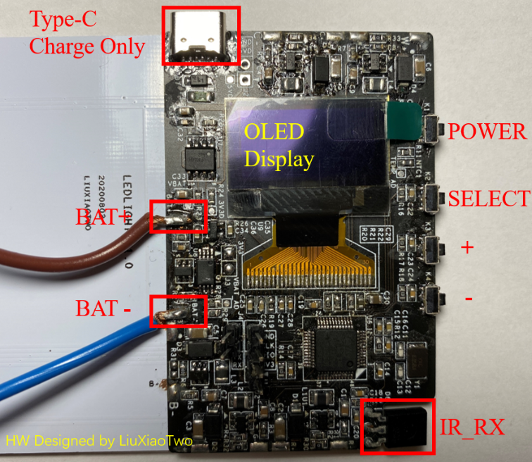
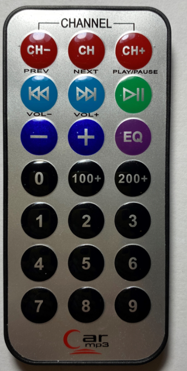

# Pocket RGB Led Light

Project create by STM32CubeMX 4.27.0 (Really don't like version 5.x that UI looks horrible. Old habit die hard!)

Build by MDK5

## Hardware picture

**Fig.1 The Button Side of PCB**

**Fig.2 The Top Side of PCB**

 																													**Fig.3 IR Remote **

## INSTRUCTIONS

- **POWER ON:**  Press **power** **button** for more than 1s.
- **POWER OFF:** Press **power** **button** for more than 1s when it's on.
- **SELECT:** Press **select button** for next, press **power button** for prev.
- **SET**: Press ➕ for add, and press ➖ for sub.
- **IR REMOTE:** 
  - **CH- :** [RGB] Hue-     [C&W] None
  - CH : switch RGB and C&W mode
  - CH+ : [RGB] Hue+     [C&W] None
  - ⏮ : [RGB] Saturation-  [C&W] Color_temp-
  - ⏭ : [RGB] Saturation+  [C&W] Color_temp+
  - ⏯ : on/off
  - ➖ : [RGB] Value-    [C&W] Bright-
  - ➕ : [RGB] Value+    [C&W] Bright+
  - EQ : NONE
  - 100+ : NONE
  - 200+ : NONE
  - 0 : special efficiency off
  - 1 : POLICE
  - 2 : AMBULIENCE
  - 3 : LIGHTNING
  - 4 : FIRE
  - 5:  COLORCHASE
  - ...

## To-Do List

- [x] LED
  - [x] RGB
  - [x] C&W
  - [x] SECEN
- [x] DISPLAY
  - [x] RGB MODE
  - [x] C&W MODE
  - [x] SECEN MODE
  - [x] CHARGING WHEN IT'S POWER OFF
- [x] IR
  - [x] RGB
  - [x] C&W
  - [x] SECEN (SPECIAL EFFICIENCY)
- [ ] TEMPERATURE CHECK
  - [ ] AUTO POWER OFF
- [x] FW LOW POWER MODE (1.3mA)
  - [x] STOP MODE  
  - [x] WAKEUP WHEN POWER_ON_EVENT OR  IN CHARGING
- [ ] BATTERY TEST
  - [ ] DISCHARGE TEST

#### Battery output current and LED output PWM duty table

|      | 0%   | 10%  | 20%  | 30%  | 40%  | 50%  | 60%  | 70%  | 80%  | 90%  | 100% |
| ---- | ---- | ---- | ---- | ---- | ---- | ---- | ---- | ---- | ---- | ---- | ---- |
| R    |      |      |      |      |      |      |      |      |      |      |      |
| G    |      |      |      |      |      |      |      |      |      |      |      |
| B    |      |      |      |      |      |      |      |      |      |      |      |
| C    |      |      |      |      |      |      |      |      |      |      |      |
| W    |      |      |      |      |      |      |      |      |      |      |      |

